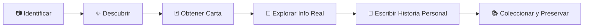

# WHO ANIMAL — GAME DESIGN DOCUMENT (GDD)

**Versión:** 0.2 (Fundación Conceptual y Arquitectura)  
**Estado:** En definición colaborativa (Director Creativo: Usuario / Project Manager: ChatGPT / Dev Principal: Antigravity)  
**Tecnología Base:** Python (Núcleo y Servicios)

---

## 1. Visión del Producto

> **"Descubre. Identifica. Colecciona."**

**WHO Animal** no es una simple herramienta utilitaria de identificación de especies. Es una **experiencia interactiva de descubrimiento, aprendizaje y colección de fauna** articulada alrededor de un sistema visual de cartas coleccionables con historias personales de los usuarios (*Lore*) y base científica rigurosa.

### El Bucle Conceptual de Experiencia (Core Loop)

1. **Identificar:** El usuario toma o sube una fotografía de un animal.
2. **Descubrir:** El sistema reconoce el animal y presenta la revelación.
3. **Obtener Carta:** Se genera y entrega la carta correspondiente con arte y atributos iniciales.
4. **Explorar Información:** El usuario gira la carta para descubrir datos biológicos, hábitat, dieta y curiosidades.
5. **Escribir Historia Personal (Lore):** El usuario puede asociar a su carta un relato corto personal de hasta 300 caracteres sobre su encuentro.
6. **Coleccionar:** El espécimen se archiva en el álbum/inventario personal de avistamientos para su consulta y futura evolución.

---

## 2. Los Tres Pilares Fundamentales

Todo el diseño y la arquitectura de datos de Who Animal respetan esta separación ontológica:

1. **INFORMACIÓN REAL:** Datos taxonómicos, biológicos, morfológicos y de conservación verídicos, contrastables y educativos.
2. **EXPERIENCIA:** Diseño de interfaz, estética de cartas, sensaciones de recompensa, descubrimiento y colección.
3. **HISTORIA PERSONAL (LORE):** Capa narrativa personal escrita por el usuario, sin ser jamás confundida con hechos científicos.

---

## 3. Especificación de la Carta

Cada animal avistado e identificado genera una carta con dos caras:

### Frente de la Carta (Atraer + Reconocer + Coleccionar)
* **Finalidad:** Puramente visual, limpia y atractiva. No sobrecargar con párrafos informativos.
* **Componentes:**
  * Fotografía o ilustración de alta calidad del animal.
  * Nombre común destacado (e.g., *Zorro Rojo*).
  * Nombre científico en tipografía secundaria (e.g., *Vulpes vulpes*).
  * Categoría taxonómica / Tipo (Mamífero, Ave, Reptil, etc.).
  * Elementos visuales del marco (tema visual, distintivo estético).
  * Metadatos de colección (código único de carta, identificador de serie).

### Reverso de la Carta (Aprender + Asombrarse + Profundizar)
* **Finalidad:** Organización clara y tipográficamente confortable de la información.
* **Componentes:**
  * **Datos Factuales:** Hábitat, distribución geográfica, alimentación, tamaño y peso típico (cuando aplique), comportamiento.
  * **Indicadores Secundarios:**
    * *Protegido:* Sí / No (sutil, sin convertir la carta en un formulario técnico).
    * *Especie rara:* Sí / No (referido a rareza biológica real, nunca como gamificación confusa).
  * **Sección de Seguridad (Condicional):**
    * ⚠️ **Precaución** o ⚠️ **Peligro**: Se activa exclusivamente para especies con riesgos reales comprobados (veneno, mordedura, agresividad territorial).
    * Enfoque: Responsable, preventivo, sin sensacionalismo ni estigmatización.
  * **Curiosidades:** Datos llamativos y asombrosos sobre su biología o hábitos.
  * **Lore (Historia Personal):** Micro-relato del usuario sobre su experiencia (hasta 300 caracteres).

---

## 4. Filosofía y Sistema Pet Friendly

**Who Animal es 100% Pet Friendly.**  
* Toda dinámica premia la **observación respetuosa y la preservación**.
* Queda excluida cualquier mecánica que recompense la perturbación, acoso o captura física de animales en la vida real.
* La fauna silvestre se respeta en su hábitat y a distancia segura.

---

## 5. Colección y Progresión

* **Álbum de Avistamientos:** Organización por biomas, categorías taxonómicas o regiones.
* **Marcadores de Completitud:** Motivación por completar grupos sin crear urgencias nocivas.
* **Variantes de Cartas (Propuesta futura):** Posibles ediciones especiales por estación, iluminación o región, siempre supeditadas a la aprobación de diseño.

---

## 6. Modelo Inicial de Monetización (Gratuito y Publicidad)

* **Núcleo Gratuito (Free-to-Play):** El descubrimiento, identificación, aprendizaje y colección de avistamientos son 100% gratuitos para el usuario.
* **Publicidad como Motor Inicial:** La plataforma se sustentará inicialmente mediante publicidad. Esta se define estrictamente como infraestructura externa, sin acoplamiento al dominio zoológico (DEC-038).
* **Rewarded Ads (Prioridad Conceptual):** La publicidad debe fluir de forma natural sin interrumpir destructivamente la experiencia del usuario. Se prioriza el uso de *Rewarded Ads* (anuncios por recompensa interactiva voluntaria) para otorgar beneficios que pertenecen exclusivamente a la capa de experiencia y no a la biológica.
* **Ausencia de Economía In-App:** Queda explícitamente excluido en esta fase inicial el diseño de "WHO Coins", tiendas virtuales, packs de pago, compras in-app o elementos "pay-to-win".
* **Respeto Absoluto a la Biología e Identidad Histórica:** Está rigurosamente prohibido monetizar, vender modificaciones o falsificar cualquier información biológica real. La rareza y atributos históricos de emisión de una carta no podrán comprarse retroactivamente.

---

## 7. Capacidades Futuras Aprobadas (Extensiones de Fases Posteriores)

Las siguientes capacidades han sido formalmente aprobadas como parte de la visión a largo plazo, manteniéndose **estrictamente fuera del alcance de la Fase 0**:

1. **Sistema de Enfrentamientos PVP:**
   * Futuro sistema de duelos o desafíos entre cartas de jugadores.
   * Totalmente independiente del perfil biológico (`Animal`), del motor de visión, de los datos científicos y del Lore.
   * Sin violencia animal real ni mecánicas contrarias a la ética *Pet Friendly*.

2. **Intercambio y Comercio de Cartas (Trading / Marketplace Controlado):**
   * Las cartas podrán transferirse entre jugadores en fases posteriores.
   * **Regla inmutable:** El cambio de dueño actualiza la custodia/posesión, pero **conserva congelada la identidad histórica** (`card_id`, `specimen_number`, generación, rareza original, población de emisión y serial de autenticación).

3. **Artwork Único y Red de Ilustradores Colaboradores:**
   * Capacidad para que un usuario solicite un diseño artístico exclusivo para una carta específica directamente desde la aplicación.
   * Flujo integrado: Solicitud → Contacto con ilustrador → Propuesta → Aprobación → Vinculación del artwork.
   * El arte personalizado es una capa visual complementaria que jamás reemplaza la taxonomía ni la información científica real.

4. **Privacidad de Captura y Protección de Fauna:**
   * La aplicación registrará internamente coordenadas GPS exactas para fines antifraude, pero la carta expondrá públicamente solo ubicaciones generalizadas para proteger a las especies silvestres contra la perturbación humana.

---

## 8. Decisiones Pendientes (Requieren Aprobación del Director/PM)

* Formato final del arte de cartas (generación procedural, plantillas vectoriales o renderizado dinámico).
* Sistema definitivo de identificación: Modelo on-device vs. API híbrida de taxonomía (iNaturalist / GBIF / Modelo custom).
* Convención formal de nomenclatura para los identificadores de cartas (`WA-MAM-001`, etc.).
* Lineamientos para la escritura y moderación de Historias Personales de los usuarios.
