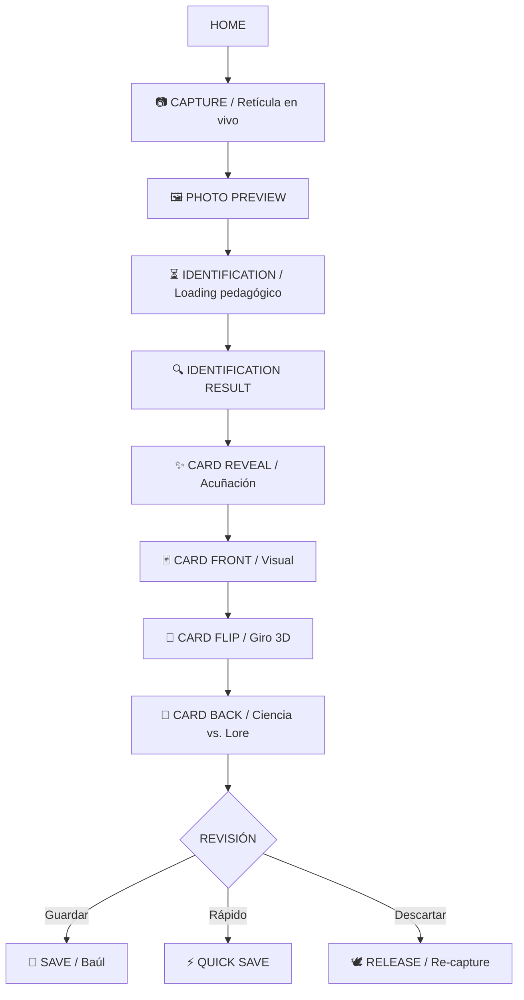

# WHO ANIMAL — GAME DESIGN DOCUMENT (GDD)

**Versión:** 1.0 (Rebaseline Oficial — WHO-DOC-001 / DEC-053)  
**Estado:** Visión de Producto Rebaselinada y Aprobada  
**Tecnología Base:**  
* **Python 3.10+:** Dominio biológico, servicios taxonómicos de referencia, validación de datasets JSON y tooling.  
* **Android Nativo (Kotlin 2.0+):** Interfaz declarativa (Jetpack Compose, Material 3), captura nativa (CameraX) y persistencia local (Room / SQLite).

---

## 1. Visión y Definición de Producto

> **"Descubre. Identifica. Colecciona."**
> 
> $$\text{WHO Animal} = \text{Identificación} + \text{Cartas Coleccionables} + \text{Enciclopedia Personal} + \text{Juego Ligero} + \text{Capa Social}$$

**WHO Animal** no es una simple herramienta utilitaria de escaneo o reconocimiento de fauna. Es una **experiencia interactiva integral de descubrimiento, aprendizaje y colección de fauna** estructurada en tres capas complementarias y concebida como un producto **Free-to-Play por diseño**.

### Arquitectura Conceptual de Producto en Tres Capas

```text
┌────────────────────────────────────────────────────────────────────────┐
│                        WHO ANIMAL ECOSYSTEM                            │
├────────────────────────────────────────────────────────────────────────┤
│  CAPA SOCIAL                                                           │
│  • Perfiles públicos  • Amigos  • Regalos  • Intercambio (Trading)     │
│  • Colecciones compartidas  • UGC  • Moderación, Reporte y Bloqueo     │
├────────────────────────────────────────────────────────────────────────┤
│  CAPA GAME                                                             │
│  • Rarezas de colección  • Estadísticas de juego (HP/ATK/DEF/SPD...)   │
│  • Duelos PvP (equipos de 10)  • Progresión y Logros  • Moneda y Shop  │
│  • Temporadas y Eventos  • Desafíos de avistamiento                    │
├────────────────────────────────────────────────────────────────────────┤
│  CAPA CORE (Irrenunciable)                                             │
│  Capture → Observation → IdentificationResult → IdentificationDecision │
│       ↓                                                                │
│    Capture → Card → Review / Flip → Persistence → Collection (Baúl)    │
└────────────────────────────────────────────────────────────────────────┘
```

1. **CAPA CORE (Irrenunciable):** El núcleo biológico y de colección. Si se retiran Game o Social, la app sigue siendo un identificador y álbum zoológico completo. Si se elimina el Core, deja de ser WHO Animal.
2. **CAPA GAME (Juego Ligero):** Progresión, duelos PvP tácticos de cartas, estadísticas lúdicas ficticias, moneda gratuita y tienda cosmética.
3. **CAPA SOCIAL (Comunidad):** Conexión ética entre exploradores, intercambio respetuoso y vitrinas públicas.

---

## 2. El Bucle de Captura — Golden Experience

La captura es el momento mágico que vincula la realidad silvestre con el universo lúdico:



### Zonas Libres de Publicidad (Ad-Free Zones)
Queda estrictamente prohibida la publicidad intrusiva durante:
* Vista de cámara y encuadre.
* Momento de disparo fotográfico.
* Carga e identificación del espécimen.
* Revelación y primer volteo de la carta.

---

## 3. Especificación de la Carta (Doble Cara)

Cada espécimen identificado y aceptado genera una carta con dos caras complementarias:

### Frente de la Carta (Card Front — Fascinar + Reconocer + Coleccionar)
* **Finalidad:** Impacto estético, limpio y coleccionable. Sin sobrecarga de texto denso.
* **Componentes:**
  * Fotografía o ilustración zoológica destacada del ejemplar avistado.
  * Nombre común predominante (e.g., *Lince Ibérico*).
  * Nombre científico en tipografía secundaria (e.g., *Lynx pardinus*).
  * Categoría taxonómica / Icono biológico (Mamífero, Ave, Reptil, etc.).
  * Marco temático y visual distintivo de colección.
  * Número de espécimen visible para el usuario (e.g., `#0042`).
  * Indicador visual de rareza de colección (marco, foil, efectos de brillo).
  * Estadísticas de juego cuando estén activas en la Capa Game.

### Reverso de la Carta (Card Back — Aprender + Profundizar + Recordar)
Estructurado para separar rigurosamente dos mundos:

#### A. Mundo Científico (Información Real y Factual)
* **Taxonomía Formal:** Reino, Filo, Clase, Orden, Familia, Género, Especie.
* **Datos Factuales:** Hábitat, distribución geográfica general, alimentación, tamaño y peso representativo, ciclo de actividad y comportamiento.
* **Indicadores Secundarios de Conservación:**
  * *Protegido:* Sí / No (discreto y sin burocracia).
  * *Especie rara:* Sí / No (referido a rareza biológica real, nunca como gamificación).
* **Sección Preventiva de Seguridad (Condicional):**
  * ⚠️ **Precaución** o ⚠️ **Peligro**: Exclusivamente para especies con riesgos zoológicos reales demostrados (veneno, mordedura, ponzoña, agresividad territorial).
  * Enfoque: Sereno, formativo y preventivo; jamás sensacionalista ni promotor de miedo.
* **Curiosidades:** Rasgos evolutivos asombrosos y adaptaciones biológicas verídicas.

#### B. Mundo Personal (Memoria del Explorador)
* **Fecha y Momento:** Timestamp de la observación.
* **Ubicación Generalizada (`display_location`):** Nombre de región o país sin coordenadas residenciales exactas, protegiendo a la fauna de cazadores y perturbación.
* **Historia Personal (Lore):** Relato personal del encuentro de hasta 300 caracteres (con límite de 3 ediciones por cuenta, según *DEC-041*).

> **Aviso de Integridad:** *La información científica jamás se confunde con el Lore del usuario ni con estadísticas de juego.*

---

## 4. Filosofía y Sistema 100% Pet Friendly

**WHO Animal es 100% Pet Friendly por diseño y principio ético:**
* Toda dinámica premia la **observación respetuosa y la preservación ecológica**.
* Queda terminantemente prohibida cualquier mecánica que recompense la perturbación, persecución, acorralamiento, toque o captura física de animales reales.
* La fauna silvestre se respeta en su hábitat y a distancia prudente.
* Si surge un conflicto entre una mecánica de juego y el bienestar animal, **prevalece siempre el bienestar de la fauna**.

---

## 5. Baúl / Corral (Colección y Almacenamiento)

El Baúl o Corral es el hogar permanente de las cartas del usuario:
* **Estructura en Contenedores:** Organización por cajas, biomas o categorías.
* **Capacidad Alpha vs. Escalabilidad:**
  * La configuración actual de **10 containers × 30 espacios = 300 cartas** es la capacidad oficial de la fase *Alpha / Foundation*.
  * Esta capacidad inicial responde a optimizaciones técnicas locales y **no constituye un techo conceptual permanente del producto**. Las versiones posteriores permitirán ampliar contenedores mediante progresión y utilidades.
* **Gestión de Cartas:** Apertura interactiva, inspección de ambas caras, animación de giro 3D, edición permitida de Lore y liberación confirmada (*Release*).

---

## 6. Modelo de Negocio: Free-to-Play por Diseño y Publicidad Desacoplada

WHO Animal es accesible gratuitamente a nivel global:

### 6.1. Principios Free-to-Play (Cero Pay-to-Win)
* El núcleo (identificar, aprender, descubrir y coleccionar) es 100% gratuito de por vida.
* **Queda estrictamente prohibido el Pay-to-Win:** Ningún pago otorgará ventajas biológicas falsas, mayor puntería de escaneo ni superioridad competitiva injusta.
* **Nunca se venderá:**
  * Mejor precisión o motor de identificación superior.
  * Modificación de datos científicos o taxonómicos.
  * Compra retroactiva de rarezas de emisión o población histórica.

### 6.2. Arquitectura Publicitaria Desacoplada (`AdService`)
La publicidad sostiene el desarrollo mediante una arquitectura externa al dominio:
* **Banner Ads:** Permitidos en Home, Baúl, Tienda, Perfil y Configuración. Prohibidos en cámara, captura, identificación, revelación, enciclopedia y combates PvP.
* **Interstitial Ads:** Únicamente en transiciones naturales y pausas lógicas, gobernados por una política de frecuencia configurable (`FrequencyPolicy`).
* **Rewarded Ads:** Anuncios voluntarios por beneficio explícito (moneda gratuita, edición adicional de Lore, multiplicadores cosméticos). Siempre con la opción clara de rechazar: *"No, gracias"*.

### 6.3. Economía y Tienda (Shop)
* **Moneda Gratuita:** Recompensa directa por avistamientos, descubrimientos de nuevas especies y cumplimiento de metas pedagógicas.
* **Tienda Ética:** Oferta exclusiva de personalización cosmética (marcos, fondos de Baúl, temas visuales, efectos brillantes, avatares y títulos de explorador).
* **Moneda Premium:** Evaluada para fases posteriores, sin ser requisito inmediato.

---

## 7. Capa Game: Duelos PvP y Progresión Ligera

El sistema de combate se integrará a partir de la fase **Release 1.x (GAME)**:
* **Formato:** Duelos de cartas ágiles, accesibles y por turnos tipo RPG ligero.
* **Equipo de 10 Cartas:** Cada jugador configura un mazo activo de 10 cartas.
* **Ventana Semanal de Edición:** El equipo activo solo puede modificarse dentro de un período semanal designado, premiando la estrategia meditada sobre el cambio reactivo.
* **Estadísticas de Juego Desacopladas:**
  ```text
  HP (Salud)       ATK (Ataque)     DEF (Defensa)
  SPD (Velocidad)  TYPE (Bioma)     SPECIAL (Habilidad)
  ```
  *Estas estadísticas son puramente lúdicas y jamás representan atributos biológicos reales de la fauna.*

---

## 8. Capa Social y de Comunidad

Desplegada a partir de la fase **Release 2.x (SOCIAL)**:
* **Perfiles y Vitrinas:** Compartir avistamientos y colecciones destacadas con la comunidad.
* **Amigos y Regalos:** Conexión entre exploradores con obsequios diarios de exploración.
* **Intercambio (Trading):** Transferencia segura de cartas entre usuarios. La titularidad (`owner_id`) se transfiere, pero los **metadatos históricos de emisión quedan perpetuamente congelados** (`card_id`, espécimen, rareza original, población y serial).
* **Seguridad y Moderación:** Filtros de lenguaje para Historias Personales (UGC), denuncia de conductas inadecuadas, bloqueo de usuarios y protección estricta de menores.

---

## 9. Internacionalización Transversal (i18n)

Se garantiza la localización global sin alterar el conocimiento zoológico:
$$\text{Traducciones de Interfaz} \neq \text{Contenido Científico Multilingüe} \neq \text{Lore Personal (Idioma Original)}$$
* Nombres científicos universales en latín.
* Fichas y textos de interfaz traducidos profesionalmente.
* Historias personales preservadas en la lengua nativa del explorador que las redactó.
