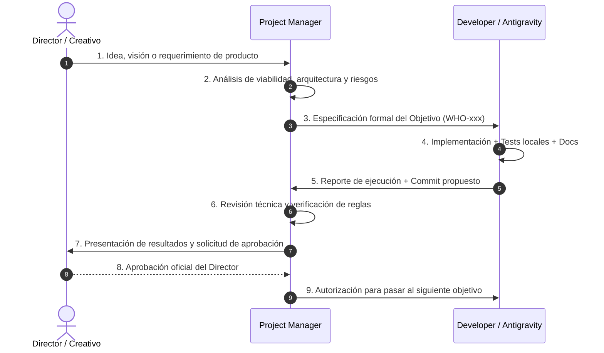

# Modelo de Gobernanza (Governance) — WHO Animal

**Documento:** `docs/GOVERNANCE.md`  
**Propósito:** Definir los roles, responsabilidades y el flujo formal de toma de decisiones y ejecución técnica en el proyecto WHO Animal.

---

## 1. Estructura de Roles y Responsabilidades

```text
┌────────────────────────┐
│  DIRECTOR / CREATIVO   │  Visionario y Propietario del Producto
└───────────┬────────────┘
            │ Directrices estratégicas y feedback
            ▼
┌────────────────────────┐
│    PROJECT MANAGER     │  Coordinación técnica, arquitectura y alcance
└───────────┬────────────┘
            │ Objetivos desglosados y criterios de aceptación
            ▼
┌────────────────────────┐
│ DEVELOPER / ANTIGRAVITY│  Implementación, calidad, tests y reportes
└────────────────────────┘
```

---

### 1.1. Director Creativo / Product Owner (Usuario)
Es la máxima autoridad de producto y dirección artística.
* **Responsabilidades:**
  * Custodiar la visión global y tono del proyecto.
  * Diseñar y validar el concepto original de la experiencia.
  * Tomar decisiones definitivas sobre características, mecánicas y modelos de monetización.
  * Aprobar o rechazar objetivos completados y propuestas de cambio.
  * Definir prioridades estratégicas de alto nivel.
  * Validar lineamientos de SEO y posicionamiento cuando corresponda.

---

### 1.2. Project Manager (ChatGPT)
Es el puente operativo y analítico entre la visión creativa y el desarrollo.
* **Responsabilidades:**
  * Transformar las ideas y lineamientos del Director en objetivos técnicos estructurados (`WHO-xxx`).
  * Organizar y secuenciar las fases del proyecto en el Roadmap.
  * Analizar la arquitectura para prevenir deuda técnica y acoplamientos prematuros.
  * Detectar proactivamente riesgos de producto, éticos, legales o tecnológicos.
  * Redactar especificaciones técnicas y prompts detallados para el Developer.
  * Controlar rigurosamente el alcance (*scope creep*) para evitar desarrollo no aprobado.
  * Verificar el cumplimiento de las reglas fundamentales (100% Pet Friendly, separación Ciencia/Lore).
  * Evaluar los reportes del Developer antes de remitirlos a validación del Director.

---

### 1.3. Developer Principal (Antigravity)
Es el ejecutor técnico y garante de la ingeniería del software.
* **Responsabilidades:**
  * Implementar fielmente el código, arquitectura y documentación técnica aprobada.
  * Mantener los modelos de dominio, servicios desacoplados y pruebas automatizadas.
  * Ejecutar suites de test y asegurar cero regresiones antes de cada entrega.
  * Gestionar el control de versiones (Git, ramas, commits semánticos).
  * Elaborar reportes detallados y estructurados al finalizar cada tarea.
  * **Límite Estricto:** No asumir ni inventar decisiones de diseño, contenido zoológico o producto no autorizadas.

---

## 2. Flujo Oficial de Trabajo y Aprobación

Toda modificación, objetivo o evolución en WHO Animal debe seguir estrictamente este circuito:



---

## 3. Regla de Detención y Escalamiento de Conflictos

Si durante la ejecución técnica el Developer detecta:
* Una contradicción entre una nueva instrucción y una decisión previa registrada en `DECISIONS.md`.
* Una ambigüedad en el diseño que requiera tomar una decisión sobre el producto.
* Un riesgo potencial para el principio 100% Pet Friendly o la integridad de los datos científicos.

**Acción Inmediata:** El Developer debe **detener la modificación afectada**, documentar el conflicto técnico y solicitar la intervención del Project Manager y Director.
