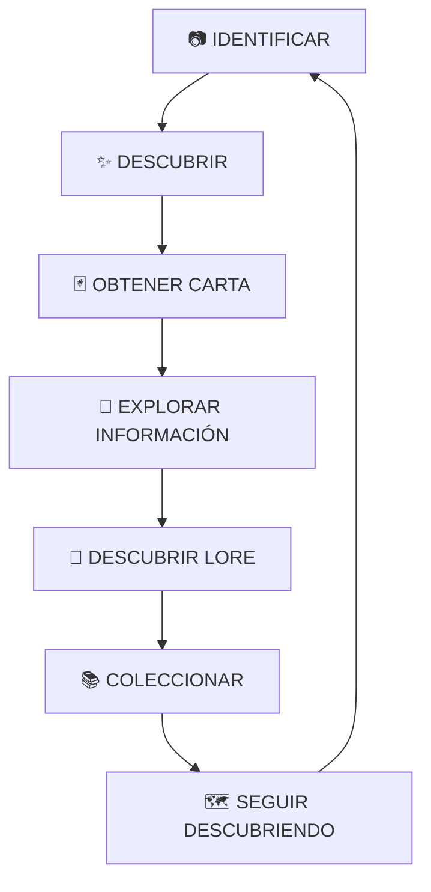

# Memoria Oficial del Proyecto (Project Context) — WHO Animal

**Documento:** `docs/PROJECT_CONTEXT.md`  
**Propósito:** Memoria y contexto fundamental de WHO Animal para asegurar coherencia transversal a lo largo de todo el ciclo de vida del producto.

---

## 1. ¿Qué es WHO Animal?

**WHO Animal** trasciende el concepto de una simple herramienta utilitaria de escaneo o identificación visual de especies. 

La visión central es construir una **experiencia integral de descubrimiento, coleccionismo y aprendizaje sobre el reino animal**, articulada a través de un sistema inmersivo de cartas coleccionables.

La identificación mediante cámara o imagen no es el destino final, sino la **puerta de entrada** a un ciclo continuo de asombro y conocimiento:



---

## 2. Los Ocho Pilares de la Experiencia

1. **Identificación:** Tecnología de visión artificial que orienta al usuario reconociendo la fauna de su entorno o de archivos gráficos.
2. **Descubrimiento:** Sensación de revelación y asombro ante la riqueza de la biodiversidad planetaria.
3. **Educación:** Transmisión de conocimientos biológicos rigurosos, hábitos zoológicos, hábitats y ecología.
4. **Cartas:** Formato visual de dos caras (Frente estético y atrayente; Reverso estructurado y formativo) que materializa cada avistamiento.
5. **Colección:** Mecánica de progresión que permite organizar especímenes en álbumes temáticos, biomas o categorías taxonómicas.
6. **Exploración:** Invitación a prestar atención a la naturaleza circundante, desde aves urbanas e insectos hasta fauna silvestre protegida.
7. **Lore:** Capa de ficción mitológica y creativa que otorga dimensión de personaje a los animales dentro del universo Who Animal.
8. **Experiencia Visual:** Diseño de interfaces moderno, limpio, con micro-interacciones de alta fidelidad, dinámico y respetuoso de la fauna.

---

## 3. Separación Ontológica Tripartita

Para garantizar la integridad ética y científica del proyecto, toda entidad, pantalla o modelo debe respetar estrictamente esta partición:

```text
┌────────────────────────────────────────────────────────────────────────┐
│                          WHO ANIMAL ECOSYSTEM                          │
├───────────────────┬───────────────────────────────┬────────────────────┤
│  INFORMACIÓN REAL │          EXPERIENCIA          │        LORE        │
├───────────────────┼───────────────────────────────┼────────────────────┤
│ • Taxonomía       │ • Estética de cartas (2 caras)│ • Leyendas y mitos │
│ • Hábitat y Dieta │ • Animaciones de volteo       │ • Arquetipos       │
│ • Tamaño y Peso   │ • Álbum de avistamientos      │ • Ficción lúdica   │
│ • Indicadores     │ • Interfaz y navegación       │ • Etiquetas claras │
│   secundarios     │ • Coleccionismo               │   de fantasía      │
│ • Precaución real │ • Sensación de logro          │                    │
├───────────────────┼───────────────────────────────┼────────────────────┤
│  100% Verificable │     100% Estimulante          │   100% Ficticio    │
└───────────────────┴───────────────────────────────┴────────────────────┘
```

* **INFORMACIÓN REAL:** Rigurosa, contrastable y de valor pedagógico. Queda terminantemente prohibido inventar datos biológicos o distorsionar la realidad zoológica.
* **EXPERIENCIA:** Elementos que dinamizan la retención, el juego, el placer de coleccionar y el aprendizaje interactivo.
* **LORE:** Universo narrativo que jamás compite ni se confunde con la ciencia; siempre se identifica con advertencias claras de ficción.

---

## 4. Filosofía del Producto

* **Diversión con Rigor:** WHO Animal debe resultar fascinante, adictivo en su afán de colección y visualmente sobresaliente, sin sacrificar jamás la veracidad científica ni la responsabilidad ecológica.
* **100% Pet Friendly:** El respeto y el bienestar animal prevalecen sobre cualquier incentivo lúdico. La fauna no se perturba, no se captura físicamente y no se somete a explotación sensacionalista.
