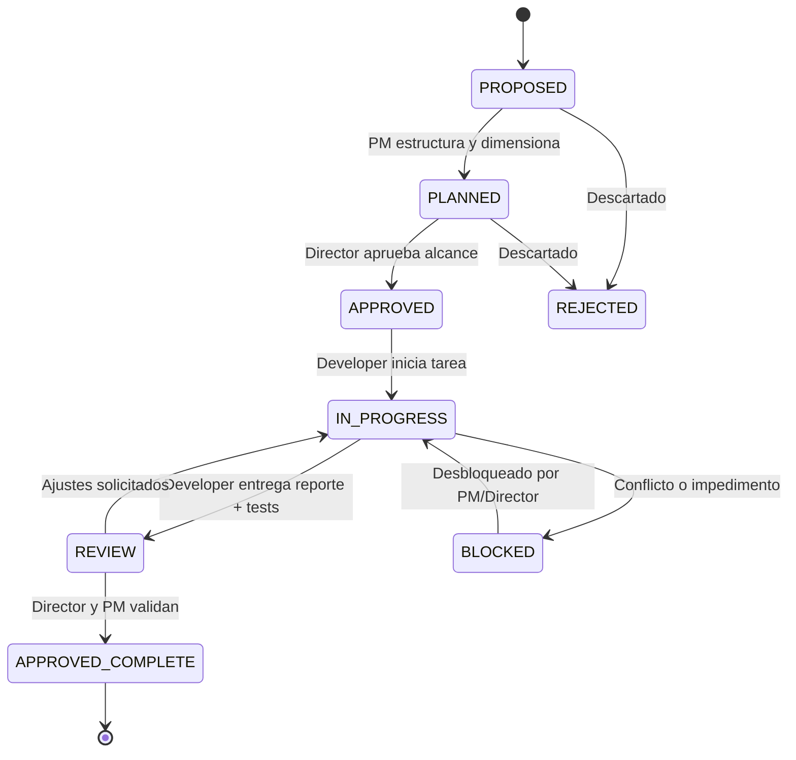

# Flujo de Trabajo Basado en Objetivos (Workflow) — WHO Animal

**Documento:** `docs/WORKFLOW.md`  
**Propósito:** Definir el ciclo de vida, la estructura estándar y las reglas de transición para cada unidad de trabajo en el proyecto.

---

## 1. Filosofía: Desarrollo Orientado a Objetivos Cerrados

En WHO Animal, el trabajo técnico no se ejecuta de forma dispersa ni en cadenas continuas desatendidas. Toda labor se estructura en **Objetivos Atómicos y Trazables** (`WHO-xxx`).

> **Regla Cardinal:**  
> **El Developer NO debe continuar automáticamente hacia objetivos futuros solo porque terminó el actual.**  
> Cada objetivo debe cerrarse, verificarse y someterse a revisión antes de autorizar el inicio del siguiente.

---

## 2. Estados de un Objetivo (Lifecycle States)



* **`PROPOSED`:** Idea o necesidad inicial planteada por el Director o el PM.
* **`PLANNED`:** Objetivo analizado, desglosado con alcance técnico y criterios de aceptación definidos por el PM.
* **`APPROVED`:** Autorizado oficialmente por el Director para su ejecución inmediata.
* **`IN_PROGRESS`:** En desarrollo activo por parte del Developer.
* **`REVIEW`:** Implementación completada con tests; en revisión técnica por el PM y Director.
* **`APPROVED_COMPLETE`:** Verificado satisfactoriamente, commiteado y formalmente cerrado.
* **`REJECTED`:** Propuesta descartada o cancelada.
* **`BLOCKED`:** Detenido por contradicciones, dependencias externas o decisiones pendientes del Director.

---

## 3. Plantilla Estándar de un Objetivo (`WHO-xxx`)

Cada tarea u objetivo debe documentarse utilizando la siguiente ficha estructural:

```markdown
### [ID]: [Nombre del Objetivo]

* **Propósito:** ¿Qué valor aporta o qué problema resuelve este objetivo?
* **Estado:** [PROPOSED | PLANNED | APPROVED | IN_PROGRESS | REVIEW | APPROVED_COMPLETE | REJECTED | BLOCKED]
* **Alcance:** Delimitación estricta de lo que se incluye y lo que queda excluido.
* **Requisitos:** Condiciones previas necesarias para comenzar.
* **Archivos Afectados:** Lista explícita de archivos creados, modificados o eliminados.
* **Criterios de Aceptación:** Condiciones verificables que determinan el éxito del objetivo.
* **Pruebas:** Estrategia de testing (unitario, integración o validación manual) ejecutada.
* **Resultado:** Resumen de la ejecución técnica e incidencias resueltas.
* **Commit Asociado:** Hash y mensaje semántico del commit en Git.
* **Versión Asociada:** Versión de proyecto vinculada (ej. `0.0.1`).
```

---

## 4. Registro Histórico de Objetivos Iniciales

### WHO-001: Exploración Inicial y Evaluación de Requisitos
* **Propósito:** Revisar el estado cero del repositorio, confirmar detención de desarrollo y verificar que no haya código prematuro.
* **Estado:** `APPROVED_COMPLETE`
* **Commit:** N/A (Fase de inspección previa a Git).
* **Versión:** `0.0.1-pre`

### WHO-002: Creación de la Estructura Documental y Fundación de Código
* **Propósito:** Establecer la primera arquitectura modular en Python, contratos de cartas y documentación conceptual inicial.
* **Estado:** `APPROVED_COMPLETE`
* **Commit:** `97a2d32` (*feat(init): base architecture, product documentation, and domain models v0.1*)
* **Versión:** `0.0.1`

### WHO-003: Gobernanza, Memoria del Proyecto y Versionado
* **Propósito:** Establecer el marco de gobernanza, memoria oficial, reglas para agentes, sistema de versionado semántico/Android y roadmap estructurado.
* **Estado:** `APPROVED_COMPLETE`
* **Commit:** `66d6c67` (*docs(governance): establish project memory, workflow and versioning*)
* **Versión:** `0.0.1`

### WHO-004: Plan Maestro de Desarrollo y Alineación por Versión
* **Propósito:** Crear el tablero operativo central `docs/PLANNING.md` para alinear en tiempo real al Director, Project Manager y Developer.
* **Estado:** `APPROVED_COMPLETE`
* **Commit:** `4e90895` (*docs(planning): establish master development planning*)
* **Versión:** `0.0.1`

### WHO-005A: Incorporación de Nuevas Decisiones al Contexto del Proyecto
* **Propósito:** Incorporar formalmente a la memoria y gobernanza las decisiones sobre entidad Animal vs. Carta, inmutabilidad de cartas, rareza dinámica ligada a población, serial visual de autenticación y criterios de validación funcional.
* **Estado:** `IN_PROGRESS`
* **Versión:** `0.0.1`
