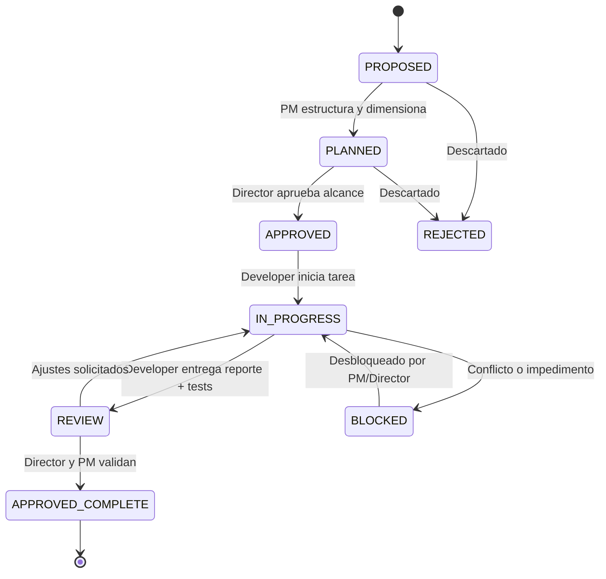

# Flujo de Trabajo Basado en Objetivos (Workflow) — WHO Animal

**Documento:** `docs/WORKFLOW.md`  
**Propósito:** Definir el ciclo de vida, la estructura estándar y las reglas de transición para cada unidad de trabajo en el proyecto.

---

## 1. Filosofía: Desarrollo Orientado a Objetivos Cerrados

En WHO Animal, el trabajo técnico no se ejecuta de forma dispersa ni en cadenas continuas desatendidas. Toda labor se estructura en **Objetivos Atómicos y Trazables** (`WHO-xxx`).

> **Regla Cardinal:**  
> **El Developer NO debe continuar automáticamente hacia objetivos futuros solo porque terminó el actual.**  
> Cada objetivo debe cerrarse, verificarse y someterse a revisión antes de autorizar el inicio del siguiente.

---

## 2. Estados de un Objetivo (Lifecycle States)



* **`PROPOSED`:** Idea o necesidad inicial planteada por el Director o el PM.
* **`PLANNED`:** Objetivo analizado, desglosado con alcance técnico y criterios de aceptación definidos por el PM.
* **`APPROVED`:** Autorizado oficialmente por el Director para su ejecución inmediata.
* **`IN_PROGRESS`:** En desarrollo activo por parte del Developer.
* **`REVIEW`:** Implementación completada con tests; en revisión técnica por el PM y Director.
* **`APPROVED_COMPLETE`:** Verificado satisfactoriamente, commiteado y formalmente cerrado.
* **`REJECTED`:** Propuesta descartada o cancelada.
* **`BLOCKED`:** Detenido por contradicciones, dependencias externas o decisiones pendientes del Director.

---

## 3. Plantilla Estándar de un Objetivo (`WHO-xxx`)

Cada tarea u objetivo debe documentarse utilizando la siguiente ficha estructural:

```markdown
### [ID]: [Nombre del Objetivo]

* **Propósito:** ¿Qué valor aporta o qué problema resuelve este objetivo?
* **Estado:** [PROPOSED | PLANNED | APPROVED | IN_PROGRESS | REVIEW | APPROVED_COMPLETE | REJECTED | BLOCKED]
* **Alcance:** Delimitación estricta de lo que se incluye y lo que queda excluido.
* **Requisitos:** Condiciones previas necesarias para comenzar.
* **Archivos Afectados:** Lista explícita de archivos creados, modificados o eliminados.
* **Criterios de Aceptación:** Condiciones verificables que determinan el éxito del objetivo.
* **Pruebas:** Estrategia de testing (unitario, integración o validación manual) ejecutada.
* **Resultado:** Resumen de la ejecución técnica e incidencias resueltas.
* **Commit Asociado:** Hash y mensaje semántico del commit en Git.
* **Versión Asociada:** Versión de proyecto vinculada (ej. `0.0.1`).
```

---

## 4. Registro Histórico de Objetivos Iniciales

### WHO-001: Exploración Inicial y Evaluación de Requisitos
* **Propósito:** Revisar el estado cero del repositorio, confirmar detención de desarrollo y verificar que no haya código prematuro.
* **Estado:** `APPROVED_COMPLETE`
* **Commit:** N/A (Fase de inspección previa a Git).
* **Versión:** `0.0.1-pre`

### WHO-002: Creación de la Estructura Documental y Fundación de Código
* **Propósito:** Establecer la primera arquitectura modular en Python, contratos de cartas y documentación conceptual inicial.
* **Estado:** `APPROVED_COMPLETE`
* **Commit:** `97a2d32` (*feat(init): base architecture, product documentation, and domain models v0.1*)
* **Versión:** `0.0.1`

### WHO-003: Gobernanza, Memoria del Proyecto y Versionado
* **Propósito:** Establecer el marco de gobernanza, memoria oficial, reglas para agentes, sistema de versionado semántico/Android y roadmap estructurado.
* **Estado:** `APPROVED_COMPLETE`
* **Commit:** `66d6c67` (*docs(governance): establish project memory, workflow and versioning*)
* **Versión:** `0.0.1`

### WHO-004: Plan Maestro de Desarrollo y Alineación por Versión
* **Propósito:** Crear el tablero operativo central `docs/PLANNING.md` para alinear en tiempo real al Director, Project Manager y Developer.
* **Estado:** `APPROVED_COMPLETE`
* **Commit:** `4e90895` (*docs(planning): establish master development planning*)
* **Versión:** `0.0.1`

### WHO-005A: Incorporación de Nuevas Decisiones al Contexto del Proyecto
* **Propósito:** Incorporar formalmente a la memoria y gobernanza las decisiones sobre entidad Animal vs. Carta, inmutabilidad de cartas, rareza dinámica ligada a población, serial visual de autenticación y criterios de validación funcional.
* **Estado:** `APPROVED_COMPLETE`
* **Commit:** `134637c` (*docs(context): incorporate animal card and rarity design principles*)
* **Versión:** `0.0.1`

### WHO-005B-A: Actualización Documental de Capacidades Futuras
* **Propósito:** Registrar en la memoria y gobernanza las decisiones de diseño para extensiones futuras (PVP, comercio/intercambio, artwork único/red de ilustradores y privacidad GPS vs. ubicación generalizada) asegurando que la arquitectura de esquemas no cierre estas capacidades.
* **Estado:** `APPROVED_COMPLETE`
* **Commit:** `172203d` (*docs(extensions): document future capabilities for pvp trading custom artwork and privacy*)
* **Versión:** `0.0.1`

### WHO-005B-C: Resolución A: Semántica de population_at_issuance
* **Propósito:** Formalizar la definición canónica, alcance (`ANIMAL/SPECIES`), inmutabilidad y relación con rareza de `population_at_issuance` (DEC-033), desacoplándolo de censos biológicos reales y métricas de plataforma.
* **Estado:** `APPROVED_COMPLETE`
* **Commit:** `507e66e` (*docs(card): define population at issuance semantics*)
* **Versión:** `0.0.1`

### WHO-005B-D: Auditoría y Resolución de verification
* **Propósito:** Resolver la semántica de `verification` (DEC-034), formalizando `verification_status` como campo mutable de estado actual (`UNVERIFIED`, `VERIFIED`, `FLAGGED`, `REVOKED`), desacoplándolo del ancla inmutable `serial` y de la identidad histórica.
* **Estado:** `APPROVED_COMPLETE`
* **Commit:** `6c2b8b1` (*docs(card): define verification semantics*)
* **Versión:** `0.0.1`

### WHO-005B-D.1: Canonicalización de verification_status y Semántica null vs UNVERIFIED
* **Propósito:** Formalizar `verification_status` como nombre canónico oficial (DEC-035), resolver la ambigüedad contractual fijando `UNVERIFIED` como estado inicial obligatorio de toda Card nueva bajo schema actual y reservar `null` exclusivamente para compatibilidad histórica con schemas previos.
* **Estado:** `APPROVED_COMPLETE`
* **Commit:** `8f661d3` (*docs(card): clarify verification status semantics*)
* **Versión:** `0.0.1`

### WHO-005C.1: Definición Conceptual de sex en Animal/Capture
* **Propósito:** Formalizar la delimitación ontológica de `sex` asignándolo a `Capture / Specimen` y excluyéndolo del modelo taxonómico `Animal` (DEC-036), definiendo los valores `MALE`, `FEMALE` y `UNKNOWN`, la regla anti-inferencia y la proyección visual en `Card`.
* **Estado:** `APPROVED_COMPLETE`
* **Commit:** `a66f069` (*docs(domain): define biological sex at capture level*)
* **Versión:** `0.0.1`

### WHO-005B-E: Auditoría Semántica Final de la Estructura Card
* **Propósito:** Realizar una auditoría semántica exhaustiva de los 19 campos conceptuales de la entidad `Card` distribuidos en 6 módulos funcionales (`identity`, `issuance`, `provenance`, `presentation`, `ownership`, `authentication`), verificando inmutabilidad, mutabilidad, límites ontológicos y ausencia de ambigüedades previo a la implementación de esquemas JSON.
* **Estado:** `APPROVED_COMPLETE`
* **Commit:** `e88e53f` (*docs(card): audit final card semantics*)
* **Versión:** `0.0.1`

### WHO-005B-E.1: Cierre Semántico de rank y rarity
* **Propósito:** Corregir y precisar las definiciones de `rank` y `rarity`: establecer que las listas de tiers de rareza son ejemplos no contractuales (curvas pendientes en DEC-022-PENDING), delimitar `rank` a la progresión/experiencia del usuario sin implicación biológica ni de combate, y consagrar la ortogonalidad absoluta e independencia bidireccional entre ambos conceptos (`rank ≠ rarity`).
* **Estado:** `APPROVED_COMPLETE`
* **Commit:** `8844010` (*docs(card): clarify rank and rarity semantics*)
* **Versión:** `0.0.1`

### WHO-006A: Definición Formal de Tipos y Obligatoriedad de los 19 Campos de Card
* **Propósito:** Formalizar documentalmente el contrato técnico de tipos, obligatoriedad (required/optional), nullability, valores por defecto e inmutabilidad de los 19 campos canónicos de `Card`, estableciendo las reglas de validación precisas sin inventar taxonomías de tiers ni mecánicas de progresión pendientes.
* **Estado:** `APPROVED_COMPLETE`
* **Commit:** `f76fca2` (*docs(card): formalize field types and requiredness*)
* **Versión:** `0.0.1`

### WHO-006A.1: Corrección del Contrato de Obligatoriedad, Nullability y Defaults de Card
* **Propósito:** Auditar y corregir el contrato formal de los 19 campos canónicos de `Card` eliminando defaults no aprobados (`schema_version`, `edition`, `generation`, `issued_at`, `rank`, `owner_id`, `display_location`, `artwork`), consagrando la regla fundamental de no inventar defaults técnicos, diferenciando formalmente `Optional` (`Required = No`) de `Nullable`, protegiendo el origen histórico de `display_location` (`historical source = protected`, `presentation = evolvable`, sin GPS exacto) y manteniendo abiertas `DEC-022-PENDING` y `DEC-037-PENDING`.
* **Estado:** `APPROVED_COMPLETE`
* **Commit:** `e05a902` (*docs(card): correct field defaults and nullability*)
* **Versión:** `0.0.1`

### WHO-006B: Implementación Formal del Modelo Card
* **Propósito:** Implementar el modelo de dominio `Card` correspondiente a los 19 campos canónicos respetando estrictamente el contrato formal aprobado en WHO-006A.1 (requiredness, nullability, tipos abiertos para rarity y rank, defaults contractuales únicos UNVERIFIED y [], inmutabilidad post-emisión y validación técnica sin dependencias externas).
* **Estado:** `NEEDS_CORRECTION`
* **Commit:** `a051d0c` (*feat(card): implement formal card domain model*)
* **Versión:** `0.0.1`

### WHO-006B.1: Corrección de Contrato Técnico del Modelo Card
* **Propósito:** Corregir discrepancias técnicas con el contrato formal: exigir estrictamente UUIDv4 en `card_id` y `capture_id` (rechazando UUIDv5/v1), formalizar `edition` como Optional no-nullable omitiéndolo de la serialización cuando está ausente y rechazando `None`, ampliar `artwork` a tipo abierto (objeto/dict, string o None), restringir `rank` a int o str sin inventar niveles, añadir protección razonable anti-GPS en `display_location` y validar el contrato con 30 tests unitarios pasando al 100%.
* **Estado:** `APPROVED_COMPLETE`
* **Commit:** `018fc4e` (*fix(card): align domain model with card contract*)
* **Versión:** `0.0.1`

### WHO-006C: Formalizar Dominio Capture/Specimen
* **Propósito:** Formalizar en el dominio la entidad `Capture / Specimen` (`capture_id` UUIDv4 estricto, `sex ∈ {MALE, FEMALE, UNKNOWN}` conforme a DEC-036), estableciendo la frontera ontológica inquebrantable `Animal ≠ Capture ≠ Card`, consagrando que el sexo biológico pertenece al individuo observado y no a la especie (`Animal`) ni es campo canónico de `Card`, con 44 tests unitarios pasando al 100%.
* **Estado:** `REVIEW`
* **Commit:** `edad99b` (*feat(domain): introduce capture specimen model*)
* **Versión:** `0.0.1`

### WHO-006D: Formalizar Modelo de Monetización Gratuito + Publicidad
* **Propósito:** Formalizar conceptualmente el modelo comercial inicial de WHO Animal como un producto 100% gratuito (Free-to-Play) en su núcleo y soportado mediante publicidad externa (DEC-038). Establecer que la publicidad (ej. AdMob) opera estrictamente en infraestructura y aislar los datos biológicos y la rareza histórica para prohibir expresamente la monetización o alteración retroactiva de la verdad zoológica o identidad de colección.
* **Estado:** `APPROVED_COMPLETE`
* **Commit:** (Pendiente de commit) (*docs(monetization): define free product and advertising model*)
* **Versión:** `0.0.1`
